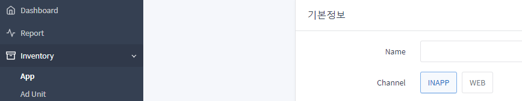
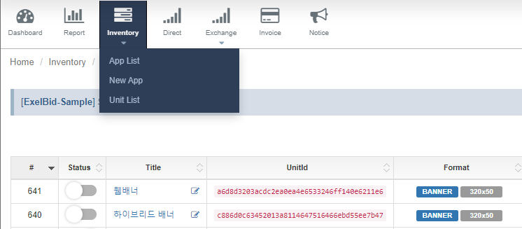
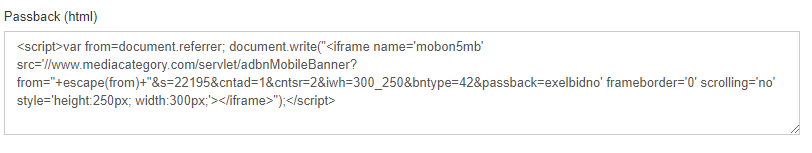

# Exelbid AdTag 연동 가이드
## 시작하기

1. 계정을 생성합니다. (https://manage.exelbid.com) 
2. Inventory -> App -> + Create New App을 선택합니다.<br/>


3. 앱정보를 등록시 <br>
Web은 Channel -> WEB,<br> 
Hybrid는 Channel->INAPP 으로 설정한다.<br>
 
4. unit을 생성 후, Unitid(TAG_ID)를 이용하여 Adtag 연동을 진행합니다.<br>
 
 
5. Passback 설정(선택) <br>
광고가 없을시 아래와 같이 설정된 Passback 코드가 적용 됩니다.<br>
 


> 헤더와 헤더 사이 혹은 가장 먼저 넣습니다.
```html
<script type='text/javascript'>
    !function (w,d,s,u,t,ss,fs) {
        if(w.exelbidtag)return;t=w.exelbidtag={};if(!window.t) window.t = t;
        t.push = function() {t.callFunc?t.callFunc.apply(t,arguments) : t.cmd.push(arguments);};
        t.cmd=[];ss = document.createElement(s);ss.async=!0;ss.src=u;
        fs=d.getElementsByTagName(s)[0];fs.parentNode.insertBefore(ss,fs);
    }(window,document,'script','//st2.exelbid.com/js/ads.js');
</script>
```
> 광고 태그를 선언합니다.
```html
<script type='text/javascript'>
    // You can get add request result
    function ExelbidResponseCallback_${TAG_ID}(result){
        // alert('status :' + status);
        if(result.status == 'OK'){
            console.log('OK');
        }else if(result.status == 'NOBID'){
            console.log('NOBID');
        }else if(result.status == 'ERROR'){
            console.log('ERROR');
        }
    };
    exelbidtag.push(function () {
        exelbidtag.initAdBanner('${TAG_ID}', ${WIDTH}, ${HEIGHT}, 'div-exelbid-${TAG_ID}')
            .setResponseCallback(ExelbidResponseCallback_${TAG_ID});
    });
</script>
<!-- Ad Space -->
<div id='div-exelbid-${TAG_ID}'>
    <script type='text/javascript'>
        exelbidtag.push(function () {
            exelbidtag.loadAd('${TAG_ID}');
        });
    </script>
</div>
```
## 함수 설명
> 모든 함수는 exelbidAdUnit 객체를 반환한다.

 함수 | required | Description | Ex                     
:-------|:-------------|:--------------------------|:-----------
initAdBanner | O | 배너를 초기화한다. tagid, width, height, ad_container 순으로넘겨줍니다. | 
loadAd | O | 광고를 요청한다. 만약 결과를 받고 싶으면 setResponseCallback 를 사용하면 된다. | 
setResponseCallback | | 콜백함수를 지원한다. OK, NOBID, ERROR 를 리턴해준다. | 
setPassbackFunc | | 로컬 Passback 함수를 설정한다. 설정시 서버 설정 패스백이 무시된다. | setPassbackFunc(ExelbidPassback_abcdefg);
setYob |  | 유저의 테어난 년도를 알고 있다면 입력한다. | setYob('1990')
setGender |  | 유저의 성별을 알고 있다면 입력한다. M,F 만 지원한다. | setGender('M')
addKeyword |  | 자체 세그먼트가 존재한다면 Key-Value 형태로 넣는다. | addKeyword('favorite', 'golf')
setTestMode |  | 개발 중에 사용할 테스트 모드이다. | setTestMode(true)
setIsInApp | O (Hyb) | 하이브리드 앱 일 경우 true 필수 | setIsInApp(true)
setIfa | O (Hyb) | 하이브리드 앱 일 경우필수. 광고 식별자 gaid 또는 idfa | setIfa('9473b438-c752-4beb-ba21-80ef9353e8bc')
setCoppa |  | DO_NOT_TRACK isLimitAdTrackingEnabled | setCoppa(true)
setMobileCountryCode |  | Mobile Country Code 국가 번호 | setMobileCountryCode('450')
setMobileNetworkCode |  | Mobile Network Code 통신사 번호 | setMobileNetworkCode('50')
setDeviceModel |  | 단말기 모델 정보 | setDeviceModel('SM-N920K')
setDeviceMake |  | 단말기 제조사 정보 | setDeviceMake('LGE')
setOsVersion |  | Android 또는 iOS의 os 버전 | setOsVersion('4.3.0')
setAppVersion |  | 어플리케이션 버전 | setAppVersion('2.3.4')
setGeo |  | LAT_LONG_KEY (latitude,longitude) 위도, 경도 | setGeo('35.2456226,128.9077138')

## Web Example
> tagid : "abcdefg", width : 320, height : 50 이고 데이타 관련 함수를 전부 썼을때에는
아래와 같습니다.
```html
<html>

<head>
    <meta http-equiv="Content-Type" content="text/html; charset=UTF-8" />
    <script type='text/javascript'>
        !function (w,d,s,u,t,ss,fs) {
            if(w.exelbidtag)return;t=w.exelbidtag={};if(!window.t) window.t = t;
            t.push = function() {t.callFunc?t.callFunc.apply(t,arguments) : t.cmd.push(arguments);};
            t.cmd=[];ss = document.createElement(s);ss.async=!0;ss.src=u;
            fs=d.getElementsByTagName(s)[0];fs.parentNode.insertBefore(ss,fs);
        }(window,document,'script','//st2.exelbid.com/js/ads.js');
    </script>
</head>

<body>
    <script type='text/javascript'>
        function ExelbidResponseCallback_abcdefg(result){
            // alert('status :' + status);
            if(result.status == 'OK'){
                console.log('OK');
            }else if(result.status == 'NOBID'){
                console.log('NOBID');
            }else if(result.status == 'ERROR'){
                console.log('ERROR');
            }
        };
        
        /*
        // local passback 을 설정하면 서버의 설정이 무시됩니다.
        // Passback 함수 - setResponseCallback(ExelbidPassback_abcdefg)와 같이 설정
        function ExelbidPassback_abcdefg(){
            // TODO
            // document.getElementById('div-exelbid-abcdefg').innerHTML = "<iframe src='http://xxx.com/banner/passback.html?a=5' scrolling='no' frameborder='0' width='100%' height='450px'>";
        };
        */
        exelbidtag.push(function () {
            exelbidtag.initAdBanner('abcdefg', 320, 50, 'div-exelbid-abcdefg')
                .setYob('1976')
                .setGender('M')
                .addKeyword('target1', 'value1')
                .addKeyword('target2', 'value2')
                .setResponseCallback(ExelbidResponseCallback_abcdefg)
                //.setPassbackFunc(ExelbidPassback_abcdefg);
                .setTestMode(true);
        });
    </script>
    <div id='div-exelbid-abcdefg'>
        <script type='text/javascript'>
            exelbidtag.push(function () {
                exelbidtag.loadAd('abcdefg');
            });
        </script>
    </div>
</body>

</html>
```

## Hybrid Example(Android)
> Hybrid에서는 광고 아이디(gaid or idfa)등의 전달의 필요합니다.<br>
 Android 에서는 아래와 같이 Javascriptinterface를 이용하여 webview와 Native 간에 데이터를 주고 받을 수 있습니다. 

1. Javainterface 클래스를 구현
### Javainterface 예제 
```java
public class WebViewInterface {
 
    private WebView mAppView;
    private Activity mContext;
 
    public WebViewInterface(Activity activity, WebView view) {
        mAppView = view;
        mContext = activity;
    }

    @JavascriptInterface public String getIfa();
    @JavascriptInterface public boolean isCoppa();
    @JavascriptInterface public boolean hasYob();
    @JavascriptInterface public String getYob();
    @JavascriptInterface public boolean hasGender();
    @JavascriptInterface public String getGender();
    @JavascriptInterface public boolean hasSegment();
    @JavascriptInterface public Map<String, String> getSegment();
    @JavascriptInterface public boolean hasMobileCountryCode();
    @JavascriptInterface public String getMobileCountryCode();
    @JavascriptInterface public boolean hasMobileNetworkCode();
    @JavascriptInterface public String getMobileNetworkCode();
    @JavascriptInterface public boolean hasCountryIso();
    @JavascriptInterface public String getCountryIso();
    @JavascriptInterface public boolean hasDeviceModel();
    @JavascriptInterface public String getDeviceModel();
    @JavascriptInterface public boolean hasDeviceMake();
    @JavascriptInterface public String getDeviceMake(;
    @JavascriptInterface public boolean hasOsVersion();
    @JavascriptInterface public String getOsVersion();
    @JavascriptInterface public boolean hasAppVersion();
    @JavascriptInterface public String getAppVersion();
    @JavascriptInterface public boolean hasOsGeo();
    @JavascriptInterfacepublic String getOsLat();
    @JavascriptInterface public String getOsLon();
}
```
2. Native(Activity)d의 WebView에 JavascriptInterface 연결 - WebViewInterface(Javascripinterface)를 'mysdk'라는 이름으로 연결
```java
public class MainActivity {
 
    private WebView mWebView = null;
    private WebViewInterface mWebViewInterface;
 
    @Override
    public void onCreate(Bundle savedInstanceState) {
        super.onCreate(savedInstanceState);
        getWindow().requestFeature(Window.FEATURE_PROGRESS);
        setContentView(R.layout.activity_main);
        mWebView = (WebView) findViewById(R.id.webview); //웹뷰 객체
        mWebViewInterface = new WebViewInterface(MainActivity.this, mWebView); //JavascriptInterface 객체화
        mWebView.addJavascriptInterface(mWebViewInterface, "mysdk"); //웹뷰에 JavascriptInterface를 연결
    }
}
```
3-1. Hybrid지면의 영역이 고정값(불변값)인 경우
 - width, height 값이 고정값(px)인 경우 javascriptinterface를 이용하여 데이타 관련 함수를 전부 썼을때에는 아래와 같습니다.

- ex) tagid : "abcdefg", width : 320px, height : 50px
```html
<html>

<head>
    <meta http-equiv="Content-Type" content="text/html; charset=UTF-8" />
    <script type='text/javascript'>
          !function (w,d,s,u,t,ss,fs) {
            if(w.exelbidtag)return;t=w.exelbidtag={};if(!window.t) window.t = t;
            t.push = function() {t.callFunc?t.callFunc.apply(t,arguments) : t.cmd.push(arguments);};
            t.cmd=[];ss = document.createElement(s);ss.async=!0;ss.src=u;
            fs=d.getElementsByTagName(s)[0];fs.parentNode.insertBefore(ss,fs);
        }(window,document,'script','//st2.exelbid.com/js/ads.js');
    </script>
</head>

<body>
    <script type='text/javascript'>
        function MyResponse(result) {
            // alert('status :' + status);
            if (result.status == 'OK') {
                //TODO 광고 처리 됨
            } else if (result.status == 'NOBID') {
                //TODO 광고없음
            } else if (result.status == 'PASSBACK') {
                //TODO PASSBACK
            } else if (result.status == 'ERROR') {
                //TODO 기타 에러
            }
        };

        exelbidtag.push(function () {
            var adunit = exelbidtag.initAdBanner('abcdefg', 320, 50, 'div-exelbid-abcdefg')
                .setResponseCallback(MyResponse)
                .setIsInApp(true); // 이것은 특별히 inapp 인 경우 반드시 해줘야 합니다. 

            adunit.setIfa(mysdk.getIfa()); // ifa(gaid or idfa) 가 없는 경우는 입찰이 거의 들어오지 않습니다.

            if (mysdk.isCoppa())
                adunit.setCoppa(true);
            if (mysdk.hasYob()) // ex) 1990
                adunit.setYob(mysdk.getYob());
            if (mysdk.hasGender()) // ex) F, M
                adunit.setGender(mysdk.getGender());
            if (mysdk.hasSegment()) // ex) seg1, 0012
                adunit.addKeyword(mysdk.getSegmentKey(), mysdk.getSegmentValue());
            if (mysdk.hasMobileCountryCode()) // ex 450
                adunit.setMobileCountryCode(mysdk.getMobileCountryCode());
            if (mysdk.hasMobileNetworkCode()) // ex 05
                adunit.setMobileNetworkCode(mysdk.getMobileNetworkCode());
            if (mysdk.hasCountryIso()) // ex kr
                adunit.setCountryIso(mysdk.getCountryIso());
            if (mysdk.hasDeviceModel()) // ex SM-N920K
                adunit.setDeviceModel(mysdk.getDeviceModel());
            if (mysdk.hasDeviceMake()) // ex LGE
                adunit.setDeviceMake(mysdk.getDeviceMake());
            if (mysdk.hasOsVersion()) // ex 7.0.1
                adunit.setOsVersion(mysdk.getOsVersion());
            if (mysdk.hasAppVersion()) // ex 1.0.2
                adunit.setAppVersion(mysdk.getAppVersion());
            if (mysdk.hasGeo()) // ex 37.01, 127.501
                adunit.setGeo(mysdk.getLat(), mysdk.getLon());
        });
    </script>
        <!--
        #div-exelbid-abcdefg 의 영역이 광고 영역입니다.
        div에 Height CSS 속성을 설정하지 마세요.
        -->
    <div id='div-exelbid-abcdefg' style="width: 320px;">
        <script type='text/javascript'>
            exelbidtag.push(function () {
                exelbidtag.loadAd('abcdefg');
            });
        </script>
    </div>
</body>

</html>
```

3-2. Hybrid지면의 영역이 가변값인 경우
 - width 값이 가변값(%)인 경우 javascriptinterface를 이용하여 데이타 관련 함수를 전부 썼을때에는 아래와 같습니다. &nbsp; 단, height값은 고정값으로 들어가야 합니다.

- ex) tagid : "abcdefg", width : 100%, height : 200px

```html
<html>

<head>
    <meta http-equiv="Content-Type" content="text/html; charset=UTF-8" />
    <script type='text/javascript'>
          !function (w,d,s,u,t,ss,fs) {
            if(w.exelbidtag)return;t=w.exelbidtag={};if(!window.t) window.t = t;
            t.push = function() {t.callFunc?t.callFunc.apply(t,arguments) : t.cmd.push(arguments);};
            t.cmd=[];ss = document.createElement(s);ss.async=!0;ss.src=u;
            fs=d.getElementsByTagName(s)[0];fs.parentNode.insertBefore(ss,fs);
        }(window,document,'script','//st2.exelbid.com/js/ads.js');
    </script>
</head>

<body>
    <script type='text/javascript'>
        function MyResponse(result) {
            // alert('status :' + status);
            if (result.status == 'OK') {
                //TODO 광고 처리 됨
            } else if (result.status == 'NOBID') {
                //TODO 광고없음
            } else if (result.status == 'PASSBACK') {
                //TODO PASSBACK
            } else if (result.status == 'ERROR') {
                //TODO 기타 에러
            }
        };

        exelbidtag.push(function () {
            var adunit = exelbidtag.initAdBanner('abcdefg', '100%', 200, 'div-exelbid-abcdefg')
                .setResponseCallback(MyResponse)
                .setIsInApp(true); // 이것은 특별히 inapp 인 경우 반드시 해줘야 합니다. 

            adunit.setIfa(mysdk.getIfa()); // ifa(gaid or idfa) 가 없는 경우는 입찰이 거의 들어오지 않습니다.

            if (mysdk.isCoppa())
                adunit.setCoppa(true);
            if (mysdk.hasYob()) // ex) 1990
                adunit.setYob(mysdk.getYob());
            if (mysdk.hasGender()) // ex) F, M
                adunit.setGender(mysdk.getGender());
            if (mysdk.hasSegment()) // ex) seg1, 0012
                adunit.addKeyword(mysdk.getSegmentKey(), mysdk.getSegmentValue());
            if (mysdk.hasMobileCountryCode()) // ex 450
                adunit.setMobileCountryCode(mysdk.getMobileCountryCode());
            if (mysdk.hasMobileNetworkCode()) // ex 05
                adunit.setMobileNetworkCode(mysdk.getMobileNetworkCode());
            if (mysdk.hasCountryIso()) // ex kr
                adunit.setCountryIso(mysdk.getCountryIso());
            if (mysdk.hasDeviceModel()) // ex SM-N920K
                adunit.setDeviceModel(mysdk.getDeviceModel());
            if (mysdk.hasDeviceMake()) // ex LGE
                adunit.setDeviceMake(mysdk.getDeviceMake());
            if (mysdk.hasOsVersion()) // ex 7.0.1
                adunit.setOsVersion(mysdk.getOsVersion());
            if (mysdk.hasAppVersion()) // ex 1.0.2
                adunit.setAppVersion(mysdk.getAppVersion());
            if (mysdk.hasGeo()) // ex 37.01, 127.501
                adunit.setGeo(mysdk.getLat(), mysdk.getLon());
        });
    </script>

    <!--
        #div-exelbid-abcdefg 의 영역이 광고 영역입니다.
        div에 Height CSS 속성을 설정하지 마세요.
    -->
    <div id='div-exelbid-abcdefg' style="width: 100%;">
        <script type='text/javascript'>
            exelbidtag.push(function () {
                exelbidtag.loadAd('abcdefg');
            });
        </script>
    </div>
</body>

</html>
```

## NATIVE MOBILE WEB
> MOBILE WEB 지면에서 NATIVE 광고를 적용 할 때<br>

HTML Template 설정
- adtag 설정은 기존 설정 방법과 똑같고, MOBILE WEB 지면 영역에 맞는 템플릿 별도 설정 해줘야함.
아래는 예시 샘플 HTML
 
 ```html
<!DOCTYPE html>
 <html>
 
 <head>
   <title>${TITLE}</title>
   <meta http-equiv='Content-Type' content='text/html; charset=UTF-8'>
   <meta name='viewport' content='width=device-width, initial-scale=1.0'>
   <style>
 
     body {
       margin: 0;
       border: 0;
       overflow: hidden;
     }
 
     #body {
       position: relative;
       min-width: 300px;
       max-width: 500px;
     }
 
     #optout {
       position: relative;
       width: 16px;
       height: 16px;
       margin-left: auto;
       content: url('${OPTOUT_IMG}');
     }
 
     #main_container{
       height: 120px;
       padding: 0 30px;
       background-color: #f7f7f7;
       display: flex;
       align-items: center;
     }
 
     #icon_wrapper {
       display: flex;
       align-items: center;
       border-radius: 4px;
       flex: 1;
     }
 
     #icon_wrapper #icon{
       width: 56px;
       height: 56px;
       background-color: white;
     }
 
     #title_container{
       flex: 8;
       padding: 0 30px;
       max-width: 70%;
       min-width: 40%;
     }
 
     #title_wrapper{
       display: flex;
     }
 
     #title_container #title_wrapper #title {
       font-size: 14px;
       margin: 0 0 5px 0;
       overflow: hidden;
       text-overflow: ellipsis;
       word-break: keep-all;
       max-width: 80%;
     }
 
     #title_container #desc {
       font-size: 10px;
       margin: 0;
       overflow: hidden;
       text-overflow: ellipsis;
       word-break: keep-all;
       display: -webkit-box;
       -webkit-line-clamp: 2;
       -webkit-box-orient: vertical;
     }
 
     #cta_wrapper{
       flex: 1;
     }
     #cta_wrapper #cta{
       width: 77px;
       height: 45px;
       display: flex;
       align-items: center;
       justify-content: center;
       border: none;
       border-radius: 4px;
       background-color: #009aff;
     }
 
     #cta_wrapper #cta:after{
       content: '${CTATEXT}';
       color: white;
       font-weight: bold;
       overflow: hidden;
       text-overflow: ellipsis;
       display: -webkit-box;
       -webkit-line-clamp: 1;
       -webkit-box-orient: vertical;
     }
 
     .overlay {
       position: absolute;
       left: 0;
       top: 0;
       width: 100%;
       height: 100%;
     }
 
   </style>
 </head>
 
 <body>
   <div id='body'>
     <a class='overlay' href='${CLICK_URL}' target='_blank'></a>
     <div id='main_container'>
       <div id='icon_wrapper'>
         
       </div>
       <div id='title_container'>
         <div id='title_wrapper'>
           <h5 id='title'>${TITLE}</h5>
           <a id='optout' href='${OPTOUT_URL}' target='_blank'></a>
         </div>
         <span id='desc'>${DESC}</span>
       </div>
       <div id='cta_wrapper'>
         <button id='cta'></button>
       </div>
     </div>
   </div>
   <script type='text/javascript'>
     try{var tags = new Array();var imgs = new Array();tags=[${ADTAG_MACRO_IMPRESSION_TAGS}];for(var i = 0; i < tags.length; i++ ){imgs[i] = new Image();imgs[i].src = tags[i];}}catch(e){}
   </script>
 </body>
 
 </html>

 ```
 Macro 설명

- ${TITLE}  : HTML TITLE 영역
- ${IMG_ICON} : 광고 아이콘 이미지
- ${IMG_MAIN} : 광고 메인 이미지
- ${CLICK_URL} : 광고 클릭 URL
- ${DESC} : 광고 DESCRIPTION
- ${CTATEXT} : CTATEXT
- ${OPTOUT_URL} : OPTOUT URL 
- ${OPTOUT_IMG} : OPTOUT IMAGE
